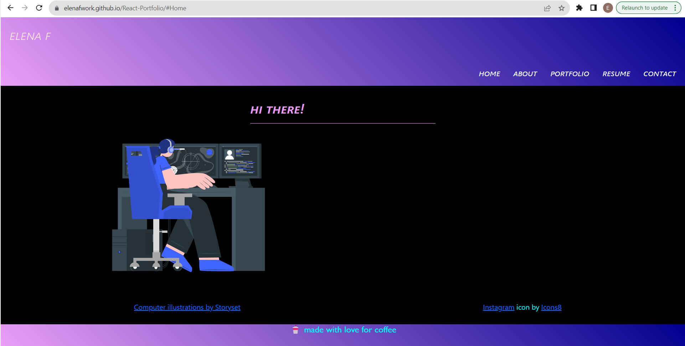

# React-Portfolio

  
  

  ## Table of Content
  - [Description](#description)
  - [Technology Used](#technology)
  - [Resources](#resources)
  - [Credits](#credits)
  - [License](#license)
  - [Questions](#questions)

  ## Description
  The Personal Portfolio built with Reactjs
  
  ## Technology Used
  - NodeJS 
  - Express.js
  - Heroku
  - PWA
  - ReactJS
  - Framer
  - Bootstrap
  ## Resources
  Deployed web application on GitHub Pages:
  https://elenafwork.github.io/React-Portfolio/
  
  The deployed application snippet:

  

 ## Credits
Special acknowledge of:
- PedroTech, "Animation in React - Framer-Motion Tutorial", https://www.youtube.com/watch?v=GOuwOI-WSkE&ab_channel=PedroTech
- [Storyset.com](https://storyset.com/) for free illustrations 
- [icon8.com](https://icons8.com/) for free icons

  ## License
  Licensed under [MIT License ](https://opensource.org/licenses/MIT)
 
  ## Questions
  If you have any questions regarding the project, please, feel free to contact me:
  - GitHub: [nohttps://github.com/elenafwork](https://github/nohttps://github.com/elenafwork)
  - Email: <elenaf.work@gmail.com>